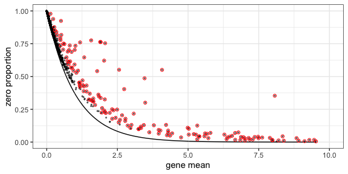
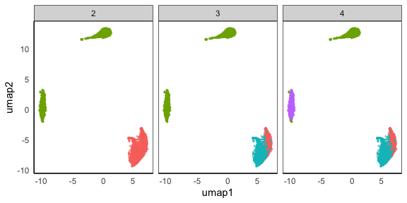
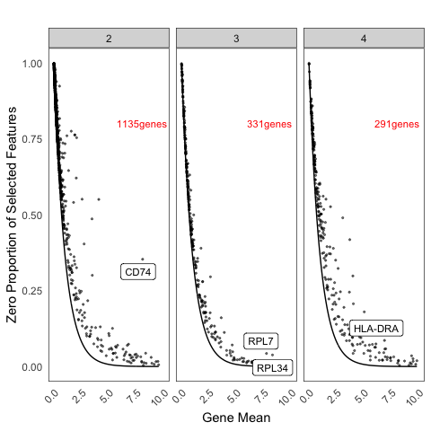
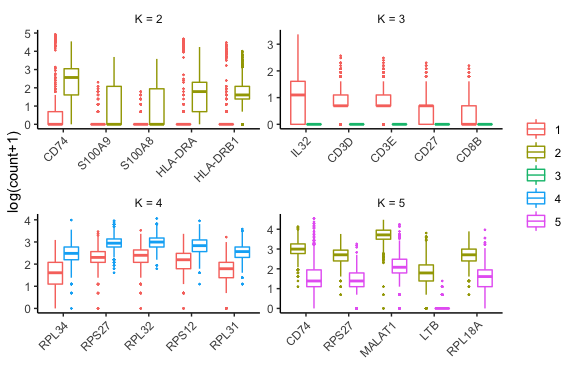

<!-- README.md is generated from README.Rmd. Please edit that file -->
HIPPO
=====

Single cell UMI analysis tool that focuses on zero-inflation to detect biological heterogeneity

Getting Started
---------------

These instructions will get you a copy of the project up and running on your local machine for development and testing purposes. See deployment for notes on how to deploy the project on a live system.

Prerequisites
-------------

HIPPO works on the SingleCellExperiment object. You can download the library like the following.

``` r
if (!requireNamespace("BiocManager", quietly = TRUE))
    install.packages("BiocManager")
BiocManager::install("SingleCellExperiment")
```

Installing
----------

HIPPO is under review for Bioconductor and CRAN submission. You can download the developer version as below. Please allow up to 5 minutes to completely compile the vignette.

``` r
devtools::install_github("tk382/HIPPO", build_vignettes = TRUE)
```

Example Analysis
================

Read the data
-------------

The data set is available in the following [link](http://imlspenticton.uzh.ch/robinson_lab/DuoClustering2018/DuoClustering2018.tar.gz), where the detailed explanation is available [here](https://github.com/markrobinsonuzh/scRNAseq_clustering_comparison). Note that the file is very large (3.3GB). We use Zhengmix4eq data set.

``` r
sce <- readRDS(url("https://github.com/tk382/HIPPO/raw/master/sce_Zhengmix4eq.rds","rb"))
```

Alternatively, you can start from a matrix object.

``` r
# X = readRDS("../zhengmix4eq_counts.rds")
# sce = SingleCellExperiment(assays = list(counts = X))
```

Diagnostic Plot
---------------

This plot shows the zero inflation compared to the expected Poisson line. If most genes don't align with the black line, it shows that there is cell heterogeneity driving the zero inflation.

``` r
hippo_diagnostic_plot(sce, show_outliers = TRUE, zvalue_thresh = 15)
```



Feature Selection and Hierarchical Clustering
---------------------------------------------

HIPPO assumes that the count matrix is placed in <sce@assays@data>$counts. Some objects that we found online have the count matrix in <sce@assays>$data$counts. In this case, HIPPO will throw an error because it cannot found a count matrix. In this case, you have to create another SingleCellExperiment object to assign the count matrix in the correct slot.

Next, you can run hippo function to do the pre-processing that simutlaneously conducts feature selection and hierarchcial clustering. There are three arguments that help you decide the stopping criterion of clustering procedure.

K is the maximum number of clusters that you want. HIPPO will return the clustering results for all k = 2, 3, ..., K, so you can overestimate the number of potential clusters. The default is 10, but users are highly recommended to adjust this.

z\_threshold is the feature selection criterion. For each round of hierarchical clustering, hippo will find outlier genes where the z-value of significance is greater than the threshold. For example, if you would like to select genes with p-values less than 0.05, z\_threshold would be 1.96. The default threshold is 2, but users can use their discretion to change this value.

outlier\_proportion is the number of outlier genes to allow. The default is 0.01 (1%) which means the clustering procedure will automatically stop if there are less than 1% of genes remain as important features. With the example data set, the default choice has empirically worked well.

``` r
set.seed(20191031)
sce = hippo(sce, K = 10, z_threshold = 2, outlier_proportion = 0.01)
#> [1] "K = 2.."
#> [1] "K = 3.."
#> [1] "K = 4.."
#> [1] "K = 5.."
#> [1] "not enough important features left; terminating the procedure"
```

Dimension Reduction for Each Round of HIPPO
-------------------------------------------

We offer two dimension reduction methods: umap and tsne. And we offer two separate visualization functions.

``` r
sce = dimension_reduction(sce, method="umap")
hippo_umap_plot(sce)
```



``` r
sce = dimension_reduction(sce, method="tsne")
hippo_tsne_plot(sce)
```


Visualize the selected features at each round
---------------------------------------------

This function shows how the zero-inflation decreases as HIPPO proceeds in the clustering. This function has arguments called switch\_to\_hgnc and ref. These aim to provide the users an option to change the gene names from ENSG IDs to HGNC symbols for ease of understanding. Many SingleCellExperiment objects have such data embedded in rowData(sce). Users can create a data frame with ensg and hgnc columns for the genes, and HIPPO will automatically switch the row names of the count matrix from ENSG IDs to HGNC symbols. The default is set to FALSE, assuming that the row names are already HGNC symbols.

``` r
ref = data.frame(hgnc = rowData(sce)$symbol,
                 ensg = rowData(sce)$id)
head(ref)
#>            hgnc            ensg
#> 1    AL627309.1 ENSG00000237683
#> 2 RP11-206L10.2 ENSG00000228327
#> 3 RP11-206L10.9 ENSG00000237491
#> 4     LINC00115 ENSG00000225880
#> 5        FAM41C ENSG00000230368
#> 6        SAMD11 ENSG00000187634
zero_proportion_plot(sce, switch_to_hgnc = TRUE, ref = ref)
```



Differential Expression Example
-------------------------------

We also offer a differential expression analysis tool.

This function also has an option to switch the gene names to HGNC symbols. top.n argument lets users choose how many top genes to show in the box plot. The default is 5.

The labels of boxplots are aligned with the t-SNE or UMAP plots above. When K is equal to 2, the color codes match with the cell groups as separated in the dimension reduction plot.

``` r
sce = diffexp(sce, top.n = 5, switch_to_hgnc = TRUE, ref = ref)
```



Each round of differential expression test results are also saved in the list of data frames.

``` r
head(sce@int_metadata$hippo$diffexp$result_table[[1]]) #round 1: monocytes
#>             genes  meandiff         sd         z     hgnc
#> 1 ENSG00000019582 11.146811 0.09138445 121.97711     CD74
#> 2 ENSG00000163220  4.086147 0.04656788  87.74604   S100A9
#> 3 ENSG00000143546  3.825106 0.04478527  85.40990   S100A8
#> 4 ENSG00000204287  5.081744 0.06486717  78.34077  HLA-DRA
#> 5 ENSG00000196126  4.565034 0.05980462  76.33246 HLA-DRB1
#> 6 ENSG00000087086  7.400703 0.09739490  75.98656      FTL
head(sce@int_metadata$hippo$diffexp$result_table[[2]]) #round 2: B cells
#>             genes  meandiff         sd        z hgnc
#> 1 ENSG00000008517 2.6307385 0.03623181 72.60854 IL32
#> 2 ENSG00000167286 1.6506986 0.02870021 57.51522 CD3D
#> 3 ENSG00000198851 1.5618762 0.02791737 55.94640 CD3E
#> 4 ENSG00000139193 0.8038922 0.02002858 40.13726 CD27
#> 5 ENSG00000172116 0.7450100 0.01928112 38.63936 CD8B
#> 6 ENSG00000227507 3.5283579 0.10424241 33.84763  LTB
head(sce@int_metadata$hippo$diffexp$result_table[[3]]) #round 3: regulatory T cells
#>             genes meandiff        sd        z  hgnc
#> 1 ENSG00000109475 7.180592 0.1288168 55.74265 RPL34
#> 2 ENSG00000177954 9.368816 0.1688232 55.49483 RPS27
#> 3 ENSG00000144713 9.576198 0.1727974 55.41864 RPL32
#> 4 ENSG00000112306 8.694732 0.1600532 54.32402 RPS12
#> 5 ENSG00000071082 7.166027 0.1321860 54.21170 RPL31
#> 6 ENSG00000177600 8.177438 0.1521632 53.74123 RPLP2
```

Authors
-------

-   [Tae Kim](https://github.com/tk382)

Acknowledgments
---------------

-   [Mengjie Chen](http://www.mengjiechen.com) provided guidance in methodology development.
-   [Yong Peng](https://github.com/bigdataage) contributed in packaging the code to meet the Bioconductor requirements.
-   The hippo icon is from [here](https://www.needpix.com/photo/178308/hippo-head-cartoon-cute-grey-zoo-wildlife)
